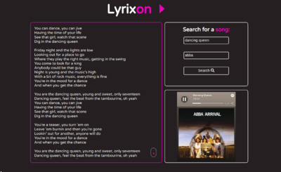

# lyrixon
Lyrixon - web app built with React, searching for music and lyrics at the same time :musical_note:

Web application using Spotify and Apiseed's Lyrics APIs which enables user to find a song
and provides apropriate lyrics at once.

### Used technologies:
- React
- CSS
- Fetch
